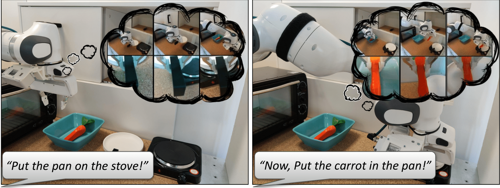

# LUMOS
[](https://github.com/psf/black)
[](https://opensource.org/licenses/MIT)

[<b>LUMOS: Language-Conditioned Imitation Learning with World Models</b>](https://arxiv.org/pdf/.pdf)

[Iman Nematollahi](https://www.imanema.com/), 
[Branton DeMoss](https://brantondemoss.com/), 
[Akshay L Chandra](https://akshaychandra.com/), 
[Nick Hawes](https://www.robots.ox.ac.uk/~nickh/), 
[Wolfram Burgard](https://www.utn.de/person/wolfram-burgard/), 
[Wolfram Burgard](https://eng.ox.ac.uk/people/ingmar-posner/)

We introduce LUMOS, a language-conditioned multi-task imitation learning framework for robotics. LUMOS learns skills by practicing them over many long-horizon rollouts in the latent space of a learned world model and transfers these skills zero-shot to a real robot. By learning on-policy in the latent space of the learned world model, our algorithm mitigates policy-induced distribution shift which most offline imitation learning methods suffer from. LUMOS learns from unstructured play data with fewer than 1% hindsight language annotations but is steerable with language commands at test time. We achieve this coherent long-horizon performance by combining latent planning with both image- and language-based hindsight goal relabeling during training, and by optimizing an intrinsic reward defined in the latent space of the world model over multiple time steps, effectively reducing covariate shift. In experiments on the difficult long-horizon CALVIN benchmark, LUMOS outperforms prior learning-based methods with comparable approaches on chained multi-task evaluations. To the best of our knowledge, we are the first to learn a language-conditioned continuous visuomotor control for a real-world robot within an offline world model.



## Installation
To begin, clone this repository locally
```bash
git clone https://github.com/nematoli/lumos.git
export LUMOS_ROOT=$(pwd)/lumos

```
Install requirements:
```bash
cd LUMOS_ROOT
conda create -n lumos_venv python=3.8
conda activate lumos_venv
sh install.sh
```

## Download
### Datasets
To download datasets used in this work, please follow [this guide](dataset/README.md).

## Citation

If you find the code useful, please cite:

**LUMOS**
```bibtex
@inproceedings{nematollahi25icra,
  author  = {Iman Nematollahi and Branton DeMoss and Akshay L Chandra and Nick Hawes and Wolfram Burgard and Ingmar Posner},
  title   = {LUMOS: Language-Conditioned Imitation Learning with World Models},
  booktitle = {Proceedings of the IEEE International Conference on Robotics and Automation (ICRA)},
  year    = {2025},
  url={http://ais.informatik.uni-freiburg.de/publications/papers/nematollahi25icra.pdf},
  address = {Atlanta, USA}
}
```

## License

MIT License
